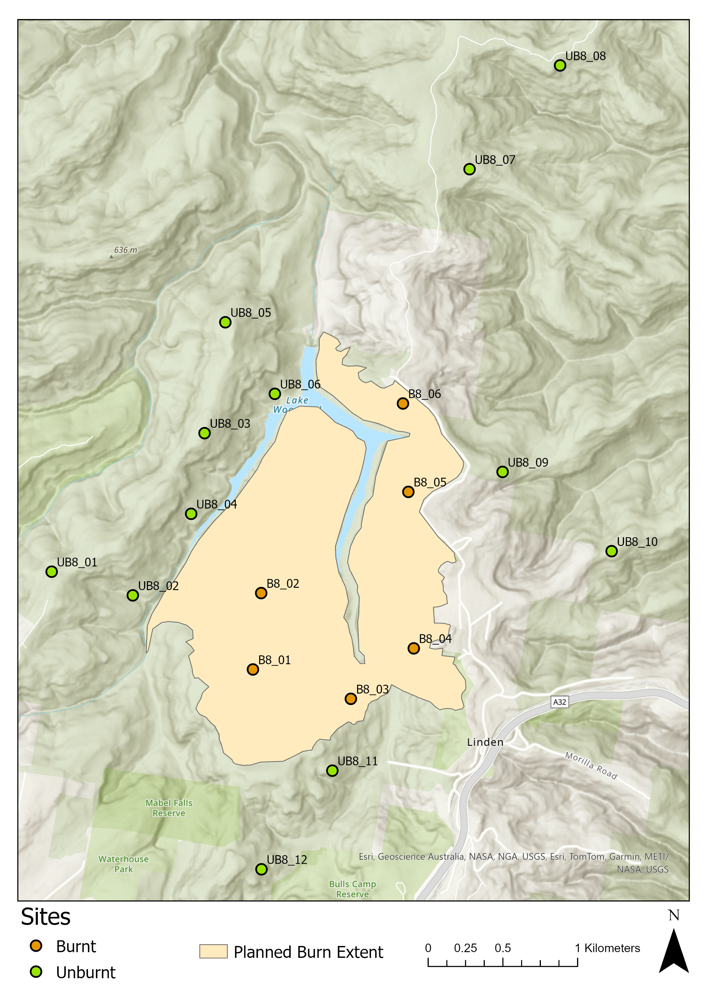

# Birds, Burns, & Bioacoustics 🔥🦅

#### **BIOL3007 — Semester 2 2026**

#### Welcome and thanks for joining project 3!

Please note that repo this is under active construction and files will be added throughout the semester.

------------------------------------------------------------------------

## Semester Timeline

| Week | Activity | Location |
|-------------------|---------------------------|---------------------------|
| 1 | Form project groups & develop ideas | Carslaw Wet Lab 301/302 |
| 2 | Groups finalise project ideas & approach | Carslaw Wet Lab 301/302 |
| 3 | Project work, draft presentations — **Project outline & Risk Assessment due Thurs 5pm** | Carslaw Wet Lab 301/302 *(Eleanor at conference but can be reached by email)* |
| 4 | **Group project presentations (assessed)** | Carslaw LT275 or Chemistry LT4 |
| 5 | Key ideas in ecology — discussion tutorials | Carslaw Wet Lab 301/302 |
| 6 | Self-directed project work — data collection | Carslaw Wet Lab 301/302 *OR* Online (decide with supervisors) |
| 7 | Key ideas in ecology (assessed, individual) — **written assessment due Mon 15 Sept 2026** | Carslaw LT275 or Chemistry LT4 |
| 8–10 | Self-directed project work — data collection | Meet with supervisor |
| 11 | Self-directed project work — results & analysis | Meet with supervisor |
| 12 | Self-directed work — summary & presentation prep | Meet with supervisor |
| 13 | **Group project presentations (assessed) — Peer Review due** | Carslaw LT275 or Chemistry LT4 |
| — | **Project report due — Sunday 8 Nov 2026, 11:59 pm (end of Week 13)** |  |

------------------------------------------------------------------------

## Overview

This project investigates how prescribed burning (or hazard-reduction burning) affects bird vocal activity in the Greater Blue Mountains. Recorders were deployed across burned and unburned sites before and after a planned burn, and recordings will be processed with [BirdNET](https://github.com/birdnet-team/BirdNET-Analyzer) to detect how species activity changes over time.

------------------------------------------------------------------------

## Study Design

### Beyond-BACI

The design is **intentionally asymmetrical**.

Rather than use a simple BACI which follows a 1:1:1:1 idea (**1 Before** dataset and **1 After** dataset at **1 Control** site and **1 Impact** site), this project uses Underwood's **Beyond-BACI** design:

-   More than one impact site and more than one control site
-   More than one "before" dataset and more than one "after" dataset
-   Longer monitoring at both control and impact sites, allowing the effects of the disturbance (fire) to be statistically separated from the effects of time

This is considered the "Holy Grail" of disturbance ecology — very difficult to implement in the field, but it offers the greatest statistical and inferential power.


#### Relevant Literature

Underwood, A. J. (1992). Beyond BACI: The detection of environmental impacts on populations in the real, but variable, world. *Journal of Experimental Marine Biology and Ecology*, 161(2), 145–178. https://doi.org/10.1016/0022-0981(92)90094-Q

📺 [Video explainer of the Beyond-BACI design](https://www.youtube.com/watch?v=optX1PcmMGY)

#### Thought Exercise
This is a small-scale study. Consider the benefits and limitations of this.

### Site Selection

-   All sites are located in dry shrubby sclerophyll forest within the Blue Mountains National Park boundary
-   Sites are placed at least 50 m off trails (100 m was the original target, but this varied on the ground)
-   Trails used for access are closed to vehicles (except authorised vehicles); some see moderate hiker/mountain-biker traffic
-   Recorders are spaced ≥500 m apart, adapted from standard camera-trap placement methods
-   **18 sites total**:
    -   6 sites within the planned burn extent: `B8_01`–`B8_06`
    -   12 sites outside the burn extent: `UB8_01`–`UB8_12`, placed at varying distances from the burn perimeter

Fires were ignited with drip torches along south and east trails. No aerial ignition was used. Fire was left to spread naturally north and west, with a lake acting as a natural firebreak. Southern border of fire extent is one trail. Eastern border is housing and then a private road as you go north. Total planned burn extent: **\~92 hectares**.

### Study Sites



### Site photos

See Powerpoint slides in images folder titled `site_images.pptx`.

*Additional site images from other times are available on request.*

## Methods

### Recording equipment

-   Each site is fitted with an autonomous recording unit (ARU): **Titley Scientific Chorus**
-   Units are programmed to record the **first 10 minutes of every hour**, every day, until the batteries die
-   Audio is captured as **16-bit WAV**, sampled at **44.1 ksps** (44,100 samples/second)
-   Recorders are cable-tied to trees with stainless steel ties, \~**170 cm above ground**

### Device set-up


### Automated species detection — BirdNET

Given the size of the dataset, manually listening to and verifying every vocalisation isn't feasible, so detections are generated with BirdNET.

-   Download: [BirdNET-Analyzer v2.4.0](https://github.com/birdnet-team/BirdNET-Analyzer/releases/tag/v2.4.0) — make sure you're all using the same Model version and GUI version.
-   Works on Windows computers or on Macs with M1 chip (not Intel). To check what chip you have go to Apple symbol in top left corner and click on `About This Mac`.
-   Can be slow to open on laptops — be patient!
-   Easiest to run on a university computer while connected to the research data store via campus wifi — set yourself up in the library one day and get some work done while BirdNET runs.

#### Relevant Literature

Kahl, S., Wood, C. M., Eibl, M., & Klinck, H. (2021). BirdNET: A deep learning solution for avian diversity monitoring. *Ecological Informatics*, 61, 101236.

#### Thought Exercises
-   Consider the benefits and limitations of relying on an AI classifier for this project.
-   Why activity, not abundance?
-   Estimating true abundance from acoustic data alone is very difficult (cue-rate methods exist but vary by species, season, sex, weather, population/region, etc., and work far better for cetaceans than birds). This project instead measures either **activity** or **presence–absence**.

## Data

Datasets are named after the **collection trip** (when the SD card was retrieved), not when the audio was actually recorded — this can be confusing, so pay attention to the table below.

| Dataset | Recorded | Collected | Relative to burn |
|----|----|----|----|
| `2025_02` | Nov 2024 | Feb 2025 | 6 months pre-burn |
| `2025_03` | Feb 2025 | Mar 2025 | 3 months pre-burn |
| — | 🔥 **Burn — April 2025** (devices restarted May 2025) |  |  |
| `2025_07` | May 2025 | Jul 2025 | 2 weeks post-burn |
| `2025_11` | Jul 2025 | Nov 2025 | 3 months post-burn |
| `2026_02` | Nov 2025 | Feb 2026 | 7 months post-burn |
| `2026_04` | Feb 2026 | Apr 2026 | 10 months post-burn |
| `2026_07` | Apr 2026 | Jul 2026 | 12 months post-burn |

### NOTE
You will **NOT** use all of these. This will be one of your first major decisions to make **as a group** and this is where you get to start creating your own experiment. Think about your aims and hypotheses. How will you go about answering them and what data would you need to achieve these aims successfully?

## Repository Structure

```         
.
├── README.md
├── images/
│   ├── aru-device.jpg
│   ├── layout6.jpg
│   ├── layout21.jpg
├── scripts/
│   ├── combine_birdnet_files
└── ... (analysis scripts, data, notebooks, etc. as the project develops)
```

## Contact

Questions or issues? Reach out via email —

-   Eleanor - **eleanor.hadfield\@sydney.edu.au**

-   Aaron - **aaron.greenville\@sydney.edu.au**

-   Glenda - **glenda.wardle\@sydney.edu.au**

### Welcome and we hope you enjoy project 3!

P.S. Here's a nicer looking map in case you want to use it. Please do not share this beyond the group. 

P.P.S. Technically it's **Ecoacoustics**, but then the alliteration is lost.
