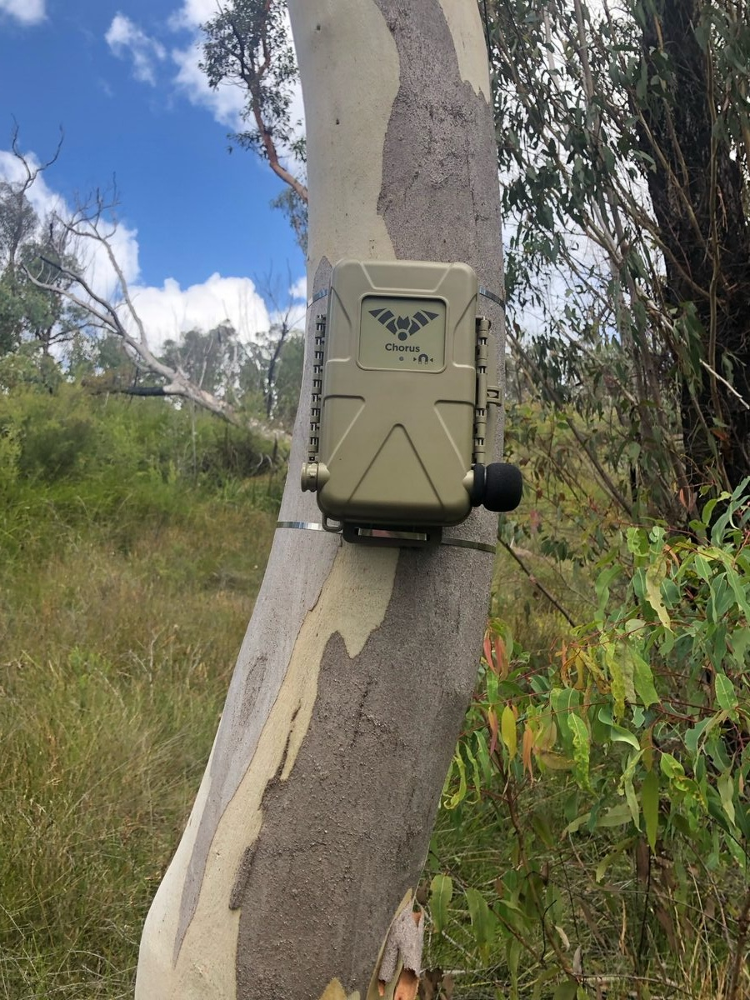
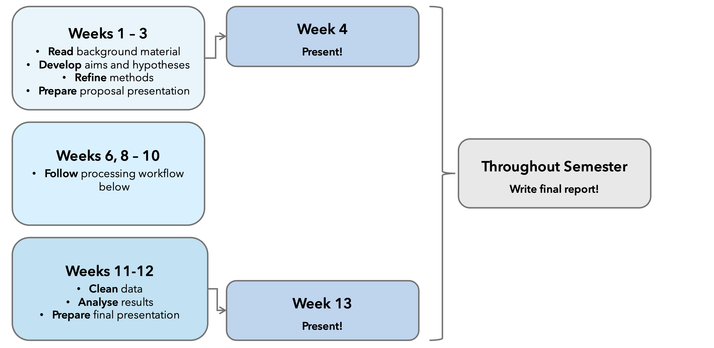
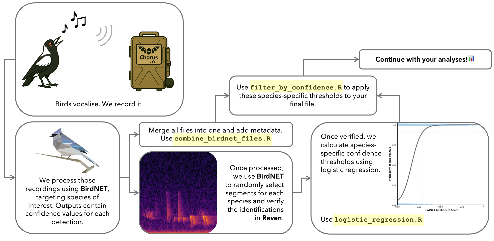

# Methods & Data

## Recording Equipment

-   Each site is fitted with an autonomous recording unit (ARU): **Titley Scientific Chorus**
-   Units are programmed to record the **first 10 minutes of every hour**, every day, until the batteries die
-   Devices are **serviced every 3 months** to capture variation in bird activity caused by migration and changes in resource availability (eg. most nectar bearing shrubs in the region flower in Autumn-Winter)
-   Audio is captured as **16-bit WAV**, sampled at **44.1 ksps** (44,100 samples/second)
-   Recorders are cable-tied to trees with stainless steel ties, \~**170 cm above ground**

## Data

Datasets are named after the **collection trip** (when the SD card was retrieved), not when the audio was actually recorded — this can be confusing, so pay attention to the table below.

| Dataset | Recorded | Collected | Relative to burn |
|----|----|----|----|
| `2025_02` | Nov 2024 | Feb 2025 | 6 months pre-burn |
| `2025_03` | Feb 2025 | Mar 2025 | 3 months pre-burn |
| — | 🔥 **Burn — April 2025** (devices restarted May 2025) |  |  |
| `2025_07` | May 2025 | Jul 2025 | 2 weeks post-burn |
| `2025_11` | Jul 2025 | Nov 2025 | 3 months post-burn |
| `2026_02` | Nov 2025 | Feb 2026 | 7 months post-burn |
| `2026_04` | Feb 2026 | Apr 2026 | 10 months post-burn |
| `2026_07` | Apr 2026 | Jul 2026 | 12 months post-burn |

::: callout-warning
## Note

You will **NOT** use all of these. This will be one of your first major decisions to make as a group and this is where you get to start creating your own experiment. Think about your aims and hypotheses. How will you go about answering them and what data would you need to achieve these aims successfully?
:::

## Automated Species Detection

Given the size of the dataset, manually listening to and verifying every vocalisation isn't feasible, so detections are generated with BirdNET.

Go to the Resources tab in the navigation bar for more information.

::: callout-note
## Relevant Literature

Kahl, S., Wood, C. M., Eibl, M., & Klinck, H. (2021). BirdNET: A deep learning solution for avian diversity monitoring. *Ecological Informatics*, 61, 101236.
:::

#### Thought Exercise

::: {.callout-tip collapse="true"}
## Consider the benefits and limitations of relying on an AI classifier for this project.

Think about accuracy, consistency, scalability, and where errors are most likely to creep in — e.g. false positives from background noise or overlapping calls, versus missed detections from quiet/distant vocalisations.
:::

::: {.callout-tip collapse="true"}
## Why activity, not abundance?

Estimating true abundance from acoustic data alone is very difficult. Cue-rate methods exist but vary by species, season, sex, weather, population/region, etc., and work better for cetaceans than birds. This project instead measures either **activity** or **presence–absence**. You get to decide which to use but you must justify your decision with sound reasoning.
:::

## Project Workflow

### Assignment Workflow

### Processing Workflow

## Key Decisions for Your Group

There is no single correct way to analyse these data. One of the goals of this project is to design and justify your own approach.

Questions to consider include:

-   [ ] What hypotheses are you testing?
-   [ ] What is the reasoning behind your hypotheses?
-   [ ] Which datasets will you use?
-   [ ] Which species or groups of species will you focus on? Or will you look at the entire community?
-   [ ] Which species do you expect to find in the study area?
-   [ ] Will you analyse activity or presence/absence?
