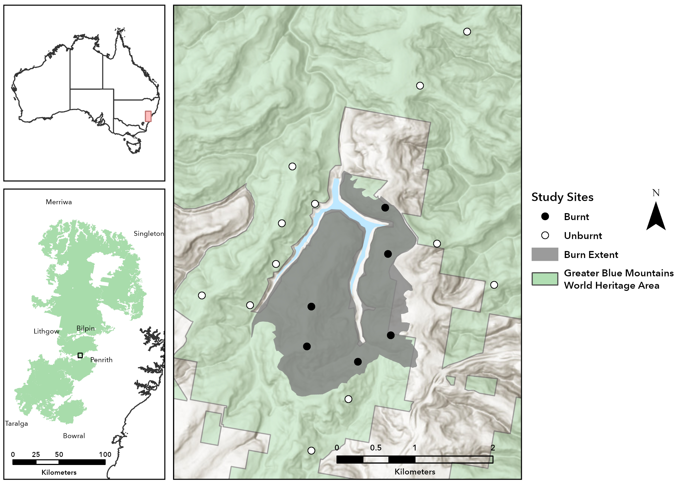

# Resources

## Literature

### Underwood (1992)

\[link\]

### Kahl et al. (2021)

[Kahl et al. 2021 (BirdNET)](https://raw.githubusercontent.com/eleanor-h43/BIOL3X07-Ecology_Project3/121e70fbc743055e172846aa5c1df31511937adb/literature/Kahl_et_al_2021_BirdNET.pdf)

::: callout-tip
## Hint

You should have read these papers before you chose this project. If you haven't, try to read these papers before your Week 4 presentations at the latest. Many of the ideas discussed in these papers are fundamental to the project and will help you understand the study design, develop stronger hypotheses, and answer questions during presentations.
:::

## Software

### BirdNET

\[link\]

## Scripts

### combine_birdnet_files

This script combines the output files generated by BirdNET into a single dataset. In addition to merging files, it extracts metadata and generates useful fields such as site, treatment, recording date, and recording time. For this script to work correctly, your files should follow the expected directory structure:

```         
trip/
├── treatment/
│   ├── site/
│   │   ├── device/
│   │   │   ├── date/
│   │   │   │   └── file.csv
```

### filter_birdnet_by_confidence

This script applies species-specific confidence thresholds to BirdNET detections. Rather than using a single confidence threshold for all species, this approach allows each species to be filtered according to the threshold that was determined during the BirdNET validation process. This generally produces more reliable datasets for downstream analyses.

## Repository Structure

We have set up this GitHub repository to provide a central location for all materials you will need throughout the semester (with the exception of the raw audio recordings). The repository will continue to grow as the project progresses, so check back regularly for updates.

### Scripts

The `scripts` [folder](https://github.com/eleanor-h43/BIOL3X07-Ecology_Project3/tree/main/scripts) contains R scripts that have been developed to automate many of the more repetitive data-processing tasks associated with acoustic datasets.

#### `combine_birdnet_files`

#### `filter_birdnet_by_confidence`

P.S. Here's a nicer looking map in case you want to use it. 
